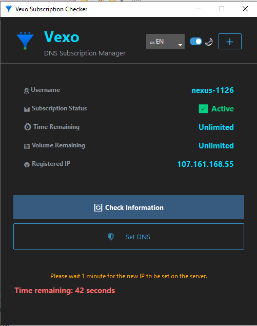

  

<h1 align="center">Vexo Subscription Checker</h1>

  A modern, multi-language GUI application for Windows to check your Vexo subscription status and manage your DNS settings with one click.

  
  
  

> [!IMPORTANT]
> This application is designed **exclusively** for subscription links generated by **Vexo Panel**. It will not work with other subscription types or providers.

---

## 📸 Screenshots

  <em>(Dark Mode / Light Mode)</em>
    
  
  &nbsp;&nbsp;&nbsp;&nbsp;
  

## ✨ Key Features

* **Subscription Dashboard:** Instantly view your:
    * 👤 **Username**
    * 📊 **Subscription Status** (Active, Expired, Limited, Disabled)
    * ⏱️ **Time Remaining**
    * 💾 **Volume Remaining**
* **Automatic IP Registration:** Automatically detects your public IP and registers it with your subscription on refresh. It informs you if your IP is new, unchanged, or if there's a conflict.
* **One-Click DNS Management:**
    * **🛡️ Connect DNS:** Instantly configures your active network adapters to use the secure Plain DNS (DoU/d53) provided by your subscription.
    * **✅ Disconnect DNS:** Reverts all your network adapters' DNS settings back to automatic (DHCP) with a single click.
* **Modern Interface:** Built with `ttkbootstrap` for a clean, modern look.
* **Theme Toggle:** Manually switch between beautiful ☀️ **Light** and 🌙 **Dark** modes.
* **Multi-Language Support:** Full UI translation for:
    * 🇬🇧 **English**
    * 🇮🇷 **Farsi (فارسی)**
    * 🇷🇺 **Russian (Русский)**
    * 🇨🇳 **Chinese (中文)**
* **Admin-Aware:** Automatically requests Administrator privileges when launched. This is required for changing system DNS settings.
* **Persistent Settings:** Remembers your last-used subscription link, language, and theme preference.

## 📋 Requirements

* **Operating System:** Windows 10 or later (due to `netsh`, `wmic`, and `ctypes` usage for DNS management).
* A valid subscription link from a **Vexo Panel**.
* An active internet connection.

## 🚀 How to Use (Recommended)

This is the easiest way for most users to get the application.

1.  Go to the [**Releases**](https://github.com/Argo160/VexoDNSw/releases) page of this repository.
2.  Download the latest `.exe` file (e.g., `VexoChecker_v1.0.exe`).
3.  Run the application. It will automatically request Administrator access, which is necessary to change your DNS.
4.  Click the `➕` button in the top-right corner to add or edit your Vexo subscription link.
5.  Click `🔄 Check Information` to fetch your data.
6.  Use the `🛡️ Connect DNS` / `✅ Disconnect DNS` button to manage your DNS settings.

## The Source will be Uploaded Soon!!? 

---

## 💖 Support & Donations
   
* **USDT (BEP20 Network - BSC):**
    `0x3729348A169359a8Aa70a0627f3737aF4c6D1929`

  <strong>Thank you for your support!</strong>

## 📄 License

This project is open-source and available under the [MIT License](LICENSE).
